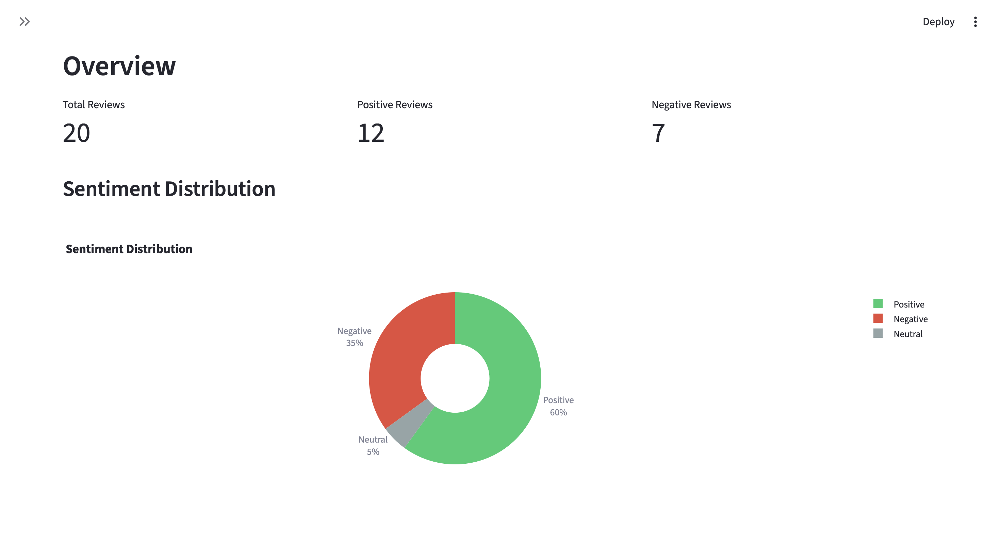

# AI-Powered Review Analyzer for Local Businesses

A Streamlit web application that analyzes customer reviews and provides structured business insights using AI-powered sentiment analysis and aspect extraction.

## Features

- **CSV Upload**: Upload review data with flexible column support
- **Text Preprocessing**: Automatic cleaning, deduplication, and language filtering
- **Sentiment Analysis**: Powered by HuggingFace's `cardiffnlp/twitter-roberta-base-sentiment-latest` model
- **Aspect Extraction**: Uses Google Gemini API to extract key aspects (food quality, service, ambiance, etc.)
- **Interactive Visualizations**: Plotly charts for sentiment distribution, trends, and aspect analysis
- **Searchable Data**: Browse and search through processed reviews with downloadable results

## Dashboard Preview



*The dashboard features three main tabs:*
- **Overview Tab**: Displays sentiment distribution with interactive donut charts and timeline visualizations
- **Aspect Analysis Tab**: Shows aspect frequency bar charts and detailed breakdowns with representative quotes
- **Raw Data Tab**: Provides a searchable table of all processed reviews with download functionality

## Tech Stack

- **Python 3.11+**
- **Streamlit** - Web application framework
- **pandas** - Data manipulation
- **HuggingFace Transformers** - Sentiment analysis
- **Google Gemini API** - Aspect extraction
- **Plotly** - Interactive visualizations
- **langdetect** - Language detection
- **rapidfuzz** - Fuzzy string matching for deduplication

## Installation

1. Clone or download this repository

2. Install dependencies:
```bash
pip install -r requirements.txt
```

3. Set up your Google Gemini API key:
   - Get an API key from [Google AI Studio](https://makersuite.google.com/app/apikey)
   - Copy `.env.example` to `.env` and add your API key:
   ```bash
   cp .env.example .env
   ```
   - Edit `.env` and add your API key

## Quick Start

1. **Install dependencies:**
```bash
cd "/Users/avikakhemuka/Documents/AI‑powered Review Analyzer for Local Businesses"
pip install -r requirements.txt
```

2. **Start the Streamlit app:**
```bash
streamlit run app.py
```

3. **Test with sample data:**
   - The app will open in your browser (usually at `http://localhost:8501`)
   - Click "Browse files" in the sidebar and upload `data/sample_reviews.csv`
   - (Optional) Enter your Google Gemini API key for aspect extraction
   - Click "🔄 Process Reviews"
   - Explore the three tabs to see the analysis results!

## Usage

1. Start the Streamlit app:
```bash
streamlit run app.py
```

2. Upload a CSV file with review data. The CSV should contain:
   - **Required**: `review_text` column
   - **Optional**: `rating`, `date`, `source` columns

3. Enter your Google Gemini API key in the sidebar (required for aspect extraction)

4. Click "Process Reviews" to analyze your data

5. Explore the results in three tabs:
   - **Overview**: Sentiment distribution and trends
   - **Aspect Analysis**: Detailed breakdown of mentioned aspects
   - **Raw Data**: Searchable table with all processed reviews

## Sample Data

A sample CSV file is included in `data/sample_reviews.csv` for testing purposes.

## CSV Format

Your CSV file should follow this format:

```csv
review_text,rating,date,source
"The food was amazing but service was slow",4,2024-01-15,google
"Terrible experience. Cold food and rude staff",1,2024-01-16,google
```

## Project Structure

```
review-analyzer/
├── app.py                 # Streamlit main app
├── src/
│   ├── __init__.py
│   ├── data_loader.py     # CSV ingestion and validation
│   ├── preprocessor.py    # Text cleaning, deduplication
│   ├── sentiment.py       # HuggingFace sentiment pipeline
│   ├── aspect_extractor.py # Gemini-based theme extraction
│   └── visualizations.py  # Plotly chart generators
├── data/
│   └── sample_reviews.csv # Sample data for testing
├── requirements.txt
├── .env.example
├── .streamlit/
│   └── config.toml        # Streamlit configuration
└── README.md
```

## Features in Detail

### Data Preprocessing
- Removes HTML tags, URLs, and email addresses
- Normalizes whitespace
- Filters non-English reviews (optional)
- Deduplicates using fuzzy matching (85% similarity threshold)

### Sentiment Analysis
- Uses state-of-the-art RoBERTa model fine-tuned on Twitter data
- Returns sentiment labels: positive, negative, neutral
- Includes confidence scores for each prediction
- Processes reviews in batches for efficiency

### Aspect Extraction
- Extracts key aspects mentioned in reviews:
  - Food quality
  - Service
  - Ambiance
  - Price
  - Cleanliness
  - Location
  - Wait time
  - Portion size
- Returns sentiment for each aspect
- Includes representative quotes
- Handles API errors with exponential backoff

### Visualizations
- **Sentiment Distribution**: Donut chart showing overall sentiment breakdown
- **Sentiment Timeline**: Line chart showing sentiment trends over time (if dates available)
- **Aspect Frequency**: Horizontal bar chart colored by sentiment ratio
- **Aspect Details**: Expandable sections with top quotes per aspect

## Error Handling

- Graceful handling of invalid CSV formats
- Clear error messages for missing required columns
- Degradation to sentiment-only mode if Gemini API fails
- Progress bars for long-running operations
- Automatic encoding detection for CSV files

## Deployment

The app is designed to work on Streamlit Cloud free tier. To deploy:

1. Push your code to GitHub
2. Connect your repository to [Streamlit Cloud](https://streamlit.io/cloud)
3. Add your `GEMINI_API_KEY` to Streamlit Cloud secrets
4. Deploy!

## Memory Usage

The application is optimized to stay under 1GB memory usage:
- Model caching with `@st.cache_resource`
- Batch processing for sentiment analysis
- Efficient data structures

## License

This project is open source and available for use.

## Contributing

Contributions are welcome! Please feel free to submit a Pull Request.

